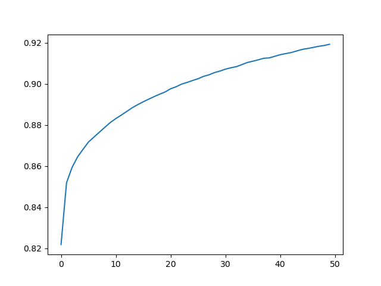

Final Project
===

[ToC]

# Intro
Hi there, welcome to my AI course's final project.


# Members
- **thoughts** neodoggy
- **coding** neoDoggy
- **finale** NeoDoggy


# Thoughts
Saw a game called "Draw and guess", an idea popped out like why can't been play with an AI? So I started off this project.


# Ideas
First of all, we need images for training the ai. So I started finding raw datasets and found google's quick draw project.
In [this](https://quickdraw.withgoogle.com/data) page, you can find dozens of pictures for projects, but how?
So I started screenshoting lol? The idea was to cut the images into squares after.
Below are some screenshots that I've taken. 
- apple

- banana

- blackberry

- blueberry

- grapes

- pear

- strawberry


Then after getting the sources, it's time for spiltting them, so I wrote a code to do it!

```py
from PIL import Image
import os

def crop(infile,height,width):
    im = Image.open(infile)
    imgwidth, imgheight = im.size
    for i in range(imgheight//height):
        for j in range(imgwidth//width):
            box = (j*width, i*height, (j+1)*width, (i+1)*height)
            yield im.crop(box)

if __name__=='__main__':
    infile='./ww.png'
    height=81
    width= 79
    start_num= 1
    for k,piece in enumerate(crop(infile,height,width),start_num):
        img=Image.new('RGB', (height,width), 255)
        img.paste(piece)
        path=os.path.join('/tmp',"IMG-%s.png" % k)
        img.save(path)
```

After all these processes, it's time to make the images into datasets.
First, I did some data augmentation by spinnin' them! Adding 6 normal spins (60deg) then 100 randomized spins.
Then I read in the the processed datas and grayscale them, by the way, also did some resize to the images else it would be a huge folder, the images located.
Afterall, output the datas into numpy files and it's all done!

```py
from numpy import genfromtxt
import matplotlib.pyplot as plt
import pandas as pd
import seaborn as sns
import numpy as np
import pydot
import os
import cv2
from PIL import Image
import random


dir='./dataimg'

for f in os.scandir(dir):
    if (f.path.endswith(".png")) and f.is_file():
        #print(f.path)
        fn=f.name
        #print(f'30{fn}')
        fi=Image.open(f.path)
        r = fi.rotate(60)
        r.save(f'./img/60{fn}')
        r = fi.rotate(90)
        r.save(f'./img/90{fn}')
        r = fi.rotate(120)
        r.save(f'./img/120{fn}')
        r = fi.rotate(180)
        r.save(f'./img/180{fn}')
        r = fi.rotate(240)
        r.save(f'./img/240{fn}')
        r = fi.rotate(300)
        r.save(f'./img/300{fn}')
        for i in range(100):
            rnd=random.randint(0, 360)
            r = fi.rotate(rnd)
            r.save(f'./img/{rnd}{fn}')

dir='./img'

meow=np.full(784,0)
meow=np.reshape(meow,(1,len(meow)))
for f in os.scandir(dir):
    if (f.path.endswith(".png")) and f.is_file():
        im=cv2.imread(f.path,cv2.IMREAD_GRAYSCALE)
        im=cv2.resize(im,(28,28),interpolation=cv2.INTER_NEAREST)
        im=~im
        im=im.flatten()
        nf=np.reshape(im,(1,len(im)))
        meow=np.concatenate((meow,nf))

meow=meow[1:]
np.save('data',meow)
```

Did some file combining. You can find it in the code in ```makefile.py```.

And it's time for training the model!!
Did some one-hot encoding. Choosing relu as the activation function for the input and hidden layers, softmax for output and categorical loss funtion for compiling due to 7 types of results.

```py
from numpy import genfromtxt
from keras.utils import np_utils
from keras.models import Sequential
from keras.layers import Dense
import matplotlib.pyplot as plt
import pandas as pd
import seaborn as sns
import numpy as np
import pydot

Dx=np.load('./datasets/traindataX.npy')
Dy=np.load('./datasets/traindataY.npy')
Tx=np.load('./datasets/testdataX.npy')
Ty=np.load('./datasets/testdataY.npy')

Dx=Dx/255
Tx=Tx/255

Dy=np_utils.to_categorical(Dy,8)
Ty=np_utils.to_categorical(Ty,8)

model=Sequential()
model.add(Dense(input_dim=28*28,units=256,activation='relu'))
model.add(Dense(units=128,activation='relu'))
model.add(Dense(units=8,activation='softmax'))
model.compile(loss='categorical_crossentropy',optimizer='adam',metrics=['accuracy'])
train_history=model.fit(x=Dx,
                        y=Dy,
                        validation_split=0.2,
                        epochs=50,
                        batch_size=600,
                        verbose=2)
#plt.plot(train_history.history['loss'])
plt.plot(train_history.history['accuracy'])
plt.show()
model.evaluate(Tx,Ty,batch_size=50)
prediction=model.predict_classes(Tx)
print(prediction[:10])
model.save('fruit')
```
Save the model and it's all done!
Below is the plot showing our accuracy:
  
By the way, the result of the final accuracy when testing the model is about 0.7, quite nice!

```Copyright neodoggy 2021```
